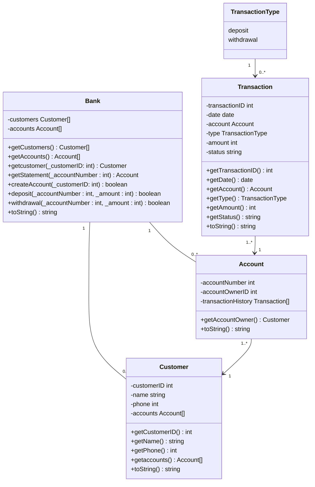

# delphiBank

> A basic banking application made with Delphi

## Introduction

I was tasked with creating a simple bank server application using a Test-Driven Development methodology.

Requirements for the application were that it must be simple, use only one currency and the user needed to be able to:

* **Create** new accounts
* **Deposit** funds into accounts
* **Withdraw** funds from accounts; and
* Generate mini bank **statements** for accounts

The application was not to include:

* **A GUI** - this is a server-only task
* **A database or storage or storage on-disk** - information must only be stored inside objects for the duration of the test suite

When developing this application, the following two pascal units were created:

1. The [test unit](#unit-tests)
2. An [Object-oriented class model](#application-class-models) for the bank and its accounts

## Unit Tests

### Create an account

The following tests are used to ensure the proper functionality for the creation of new accounts.

|Test No.|Description|Test Instructions|Expected Result|Status|
|---|---|---|---|---|
|1|Ensure new accounts are successfully created|Create an account for a new customer|A new account should be created|Pass or Fail|
|2|Ensure duplicate accounts cannot be created|Create a duplicate account for an already-existing customer|Creation of the account should be denied|Pass or Fail|

### Make a Deposit

The following tests are used to ensure the proper functionality for depositing funds into accounts

|Test No.|Description|Test Instructions|Expected Result|Status|
|---|---|---|---|---|
|1|Ensure funds are able to be deposited into existing customer accounts|Deposit funds into a customer's account|A deposit should be made into the account|Pass or Fail|
|2|Ensure funds cannot be made into non-existent accounts|Attempt to make a deposit into an account that doesn't exist|The deposit should be denied|Pass or Fail|
|3|Ensure only funds in positive numbers can be deposited|Attempt to make a deposit into an account using a number equal to or less than 0|The deposit should be denied|Pass or Fail|

### Make a Withdrawal

The following tests are used to ensure the proper functionality for withdrawing funds from accounts

|Test No.|Description|Test Instructions|Expected Result|Status|
|---|---|---|---|---|
|1|Ensure funds are able to be withdrawn from existing customer accounts|Withdraw funds from a customer's account|A withdrawal should be made from the account|Pass or Fail|
|2|Ensure funds cannot be withdrawn from non-existent accounts|Attempt to make a withdrawal from an account that doesn't exist|The withdrawal should be denied|Pass or Fail|
|3|Ensure only funds in postive numbers can be withdrawn|Attempt to make a withdrawal from an account using a number equal to or less than 0|The withdrawal should be denied|Pass or Fail|

### Generate a mini statement

The following tests are used to ensure the proper functionality for the generation of mini statements

|Test No.|Description|Test Instructions|Expected Result|Status|
|---|---|---|---|---|
|1|Ensure statements are successfully generated|Generate a statement for an account|A statement should be generated|Pass or Fail|
|2|Ensure statements cannot be created for non-existent accounts|Generate a statement for an account that doesn't exist|Generation of the statement should be denied|Pass or Fail|

## Application Class Models

The following classes were designed for the bank and its accounts.

