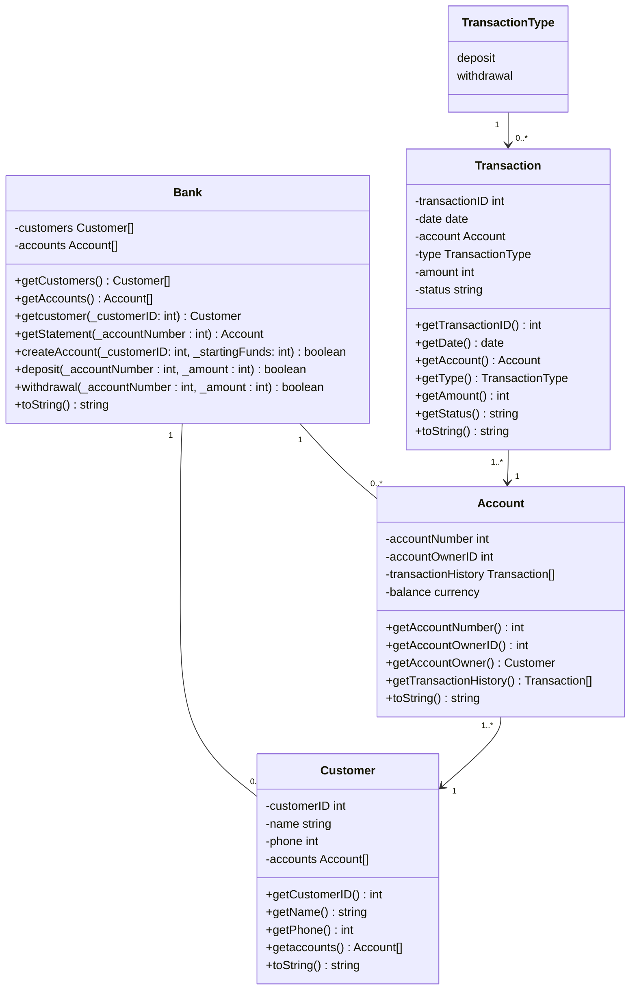

# delphiBank <!-- omit in toc -->

> A basic banking application made with Delphi

## Contents <!-- omit in toc -->

- [Introduction](#introduction)
- [Design](#design)
  - [Unit Tests](#unit-tests)
    - [Create an Account](#create-an-account)
    - [Make a Deposit](#make-a-deposit)
    - [Make a Withdrawal](#make-a-withdrawal)
    - [Generate a Mini Statement](#generate-a-mini-statement)
  - [Application Class Models](#application-class-models)
- [Development](#development)
- [Outcome](#outcome)

## Introduction

I was tasked with creating a simple bank server application using a Test-Driven Development methodology.

Requirements for the application were that it must be simple, use only one currency and the user needed to be able to:

- **Create** new accounts
- **Deposit** funds into accounts
- **Withdraw** funds from accounts; and
- Generate mini bank **statements** for accounts

The application was *not* to include:

- **A GUI** - this is a server-only task
- **A database or storage or storage on-disk** - information must only be stored inside objects for the duration of the test suite

The following two pascal units were required:

1. A test unit
2. An object-oriented class model

The purposes of this task were to test if I can:

1. Follow a given task and adapt to a new way of development, using an unfamiliar framework ([DUnitX](https://github.com/VSoftTechnologies/DUnitX))
2. Devise tests to ensure the proper functionality of a program, including:
   - Does the normal use-case work?
   - Do certain cases fail (i.e., overdrawing an account)
3. Design object model classes
4. Manage the memory usage of a program, ensuring no memory leaks occur
5. Balance the complexity of a program, ensuring it is neither under nor over-engineered

## Design

### Unit Tests

The following tests were devised to ensure the proper functionality of the banking system.

#### Create an Account

|Test No.|Description|Test Instructions|Expected Result|Status|
|---|---|---|---|---|
|1|Ensure new accounts are successfully created|Create an account for a new customer|A new account should be created|Pass or Fail|
|2|Ensure duplicate accounts cannot be created|Create a duplicate account for an already-existing customer|Creation of the account should be denied|Pass or Fail|

#### Make a Deposit

|Test No.|Description|Test Instructions|Expected Result|Status|
|---|---|---|---|---|
|1|Ensure funds are able to be deposited into existing customer accounts|Deposit funds into a customer's account|A deposit should be made into the account|Pass or Fail|
|2|Ensure funds cannot be made into non-existent accounts|Attempt to make a deposit into an account that doesn't exist|The deposit should be denied|Pass or Fail|
|3|Ensure only funds in positive numbers can be deposited|Attempt to make a deposit into an account using a number equal to or less than 0|The deposit should be denied|Pass or Fail|

#### Make a Withdrawal

|Test No.|Description|Test Instructions|Expected Result|Status|
|---|---|---|---|---|
|1|Ensure funds are able to be withdrawn from existing customer accounts|Withdraw funds from a customer's account|A withdrawal should be made from the account|Pass or Fail|
|2|Ensure funds cannot be withdrawn from non-existent accounts|Attempt to make a withdrawal from an account that doesn't exist|The withdrawal should be denied|Pass or Fail|
|3|Ensure only funds in postive numbers can be withdrawn|Attempt to make a withdrawal from an account using a number equal to or less than 0|The withdrawal should be denied|Pass or Fail|

#### Generate a Mini Statement

|Test No.|Description|Test Instructions|Expected Result|Status|
|---|---|---|---|---|
|1|Ensure statements are successfully generated|Generate a statement for an account|A statement should be generated|Pass or Fail|
|2|Ensure statements cannot be created for non-existent accounts|Generate a statement for an account that doesn't exist|Generation of the statement should be denied|Pass or Fail|

### Application Class Models

The following UML diagram shows the classes that were designed for the bank and its accounts. It also shows their relationships and cardinality.

## Development

I developed the application using the free [Community Edition](https://www.embarcadero.com/products/delphi/starter) of Delphi 11 via embarcadero.

I will update development of the application later

## Outcome

I will update outcome of the application later
