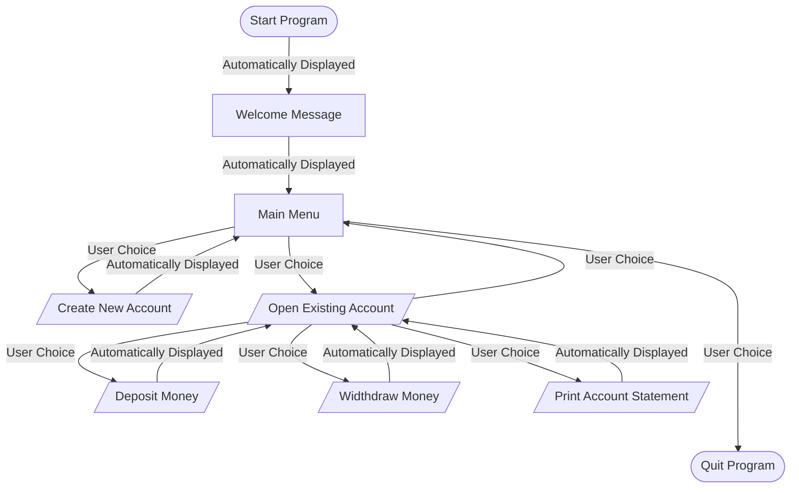
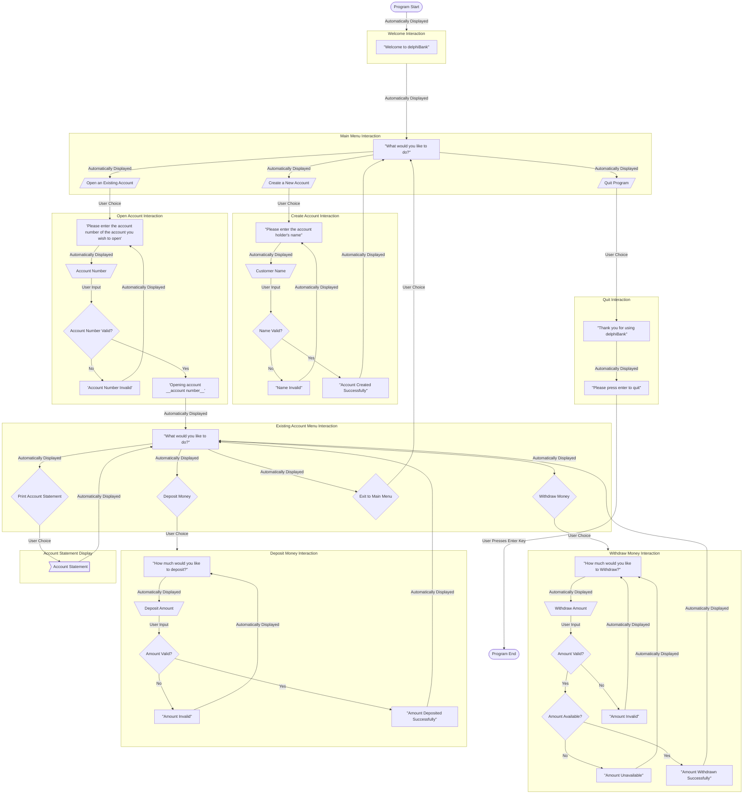
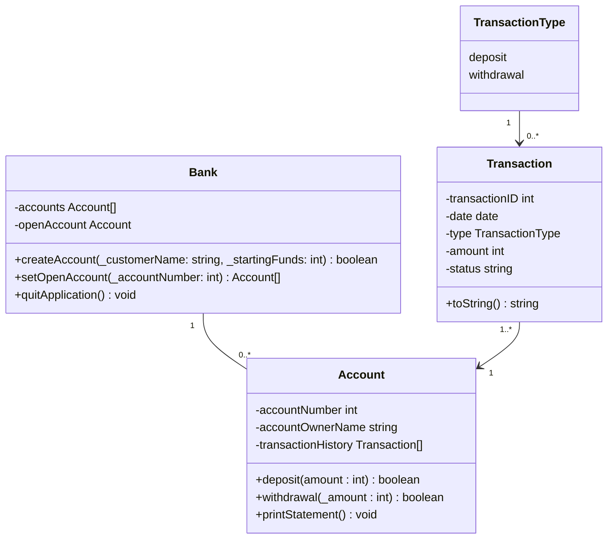

# delphiBank <!-- omit in toc -->

> A basic banking application made with Delphi

## Contents <!-- omit in toc -->

- [Introduction](#introduction)
- [Design](#design)
  - [Program Logical Flow](#program-logical-flow)
  - [Program Interface](#program-interface)
  - [Class Models](#class-models)
  - [Unit Tests](#unit-tests)
    - [1. Create an Account](#1-create-an-account)
    - [2. Make a Deposit](#2-make-a-deposit)
    - [3. Make a Withdrawal](#3-make-a-withdrawal)
    - [4. Generate a Mini Statement](#4-generate-a-mini-statement)
- [Development](#development)
- [Outcome](#outcome)

## Introduction

I was tasked with creating a simple bank server application using a Test-Driven Development methodology.

Requirements for the application were that it must be simple, use only one currency and the user needed to be able to:

- **Create** new accounts
- **Deposit** funds into accounts
- **Withdraw** funds from accounts; and
- Generate mini bank **statements** for accounts

The application was *not* to include:

- **A GUI** - this is a server-only task
- **A database or storage or storage on-disk** - information must only be stored inside objects for the duration of the test suite

The following two pascal units were required:

1. A test unit
2. An object-oriented class model

The purposes of this task were to test if I can:

1. Follow a given task and adapt to a new way of development, using an unfamiliar framework ([DUnitX](https://github.com/VSoftTechnologies/DUnitX))
2. Devise tests to ensure the proper functionality of a program, including:
   - Does the normal use-case work?
   - Do certain cases fail (i.e., overdrawing an account)
3. Design object model classes
4. Manage the memory usage of a program, ensuring no memory leaks occur
5. Balance the complexity of a program, ensuring it is neither under nor over-engineered

## Design

### Program Logical Flow

I began designing this system by considering its logical flow - including the sequence of steps taken, decisions made, and actions performed by users when interacting with it. The logical flow of this program is shown in the flowchart below.

### Program Interface

After plotting the [logical flow](#program-logical-flow) of the program, I considered how the steps, decisions and actions of the program would be presented to the user. As the task specified there should be no GUI for this program, I decided to use an "interaction system". Each interaction includes one or more sequence/s of:

- A **prompt** - which advises the user what they should / can do next
- An opportunity for the user to provide some **input** in response to the given prompt
- **Validation** of the user input - to ensure that the user gave a valid response to the given prompt; and
- **Confirmation** of the user's success in providing a valid response to the given prompt
  - **Note**: If the user's response is deemed invalid, the interaction will begin again

The successful completion of each interaction will trigger the initialisation of the next.

The following flowchart translates the program's logical flow into a graphical representation of these "interactions".

### Class Models

Once the above flowchart was created to demonstrate how users would the [interface](#program-interface) with this program, I was able to design the classes that would be required by the system. The following UML diagram shows these classes and the relationships and cardinality between them.

### Unit Tests

Finally, after creating [models](#class-models) for the classes of this program, I was able to write tests to ensure the proper functionality of the banking system. Tests for the 4 main interaction requirements of the program are presented below.

#### 1. Create an Account

|Test No.|Description|Test Instructions|Expected Result|Status|
|---|---|---|---|---|
|1|Ensure new accounts are successfully created when a valid names and starting balances are given|Create an account for a customer with a valid name|A new account should be created|Pass or Fail|
|2|Ensure new accounts are not created when invalid names are given|Create an account for a customer with an invalid name|A new account should not be created|Pass or Fail|
|3|Ensure new accounts are not created when invalid starting balances are given|Create an account for a customer with an invalid starting balance|A new account should not be created|Pass or Fail|

#### 2. Make a Deposit

|Test No.|Description|Test Instructions|Expected Result|Status|
|---|---|---|---|---|
|1|Ensure valid funds are able to be deposited into accounts|Deposit valid funds into an account|A deposit should be made successfully|Pass or Fail|
|2|Ensure invalid funds cannot be deposited|Attempt to make a deposit into an account using a number equal to or less than 0|The deposit should be denied|Pass or Fail|

#### 3. Make a Withdrawal

|Test No.|Description|Test Instructions|Expected Result|Status|
|---|---|---|---|---|
|1|Ensure valid funds are able to be withdrawn from accounts|Withdraw valid funds from an account|A withdrawal should be made successfully|Pass or Fail|
|2|Ensure invalid funds cannot be withdrawn|Attempt to make a withdrawl from an account using a number equal to or less than 0|The withdrawal should be denied|Pass or Fail|
|3|Ensure customers cannot overdraw accounts|Attempt to make a withdrawal from an account using a number which is higher than the account's available balance|The withdrawal should be denied|Pass or Fail|

#### 4. Generate a Mini Statement

|Test No.|Description|Test Instructions|Expected Result|Status|
|---|---|---|---|---|
|1|Ensure statements are successfully generated|Generate a statement for an account|A statement should be generated|Pass or Fail|

## Development

I developed the application using the free [Community Edition](https://www.embarcadero.com/products/delphi/starter) of Delphi 11 via embarcadero.

I will update development of the application later

## Outcome

I will update outcome of the application later
